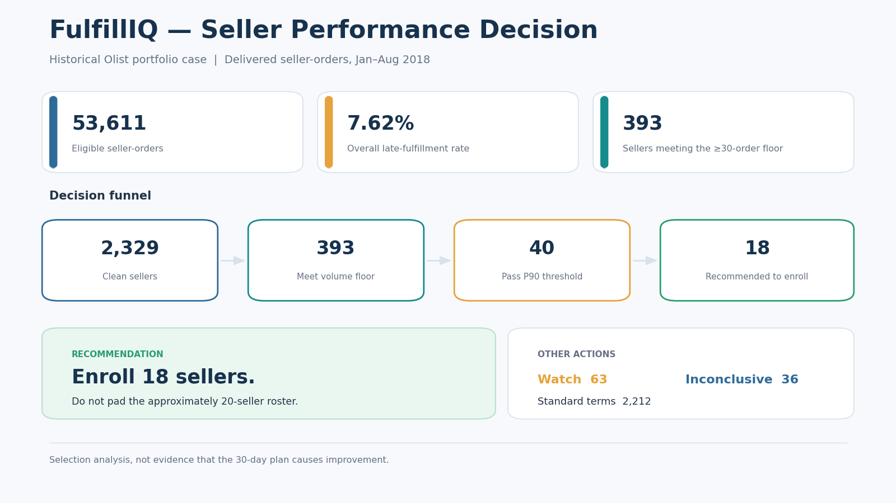
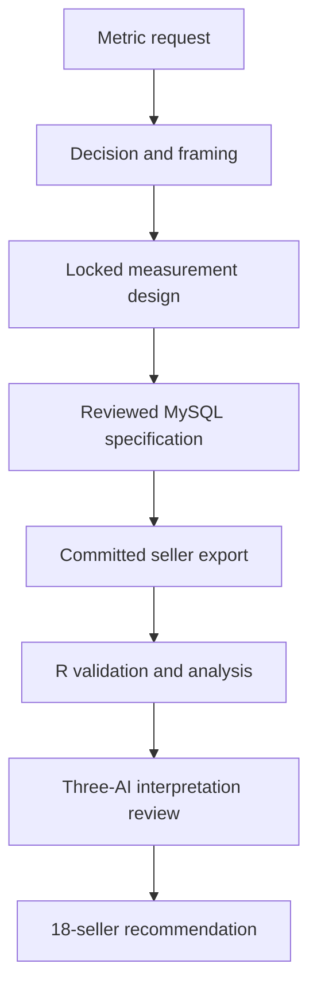

# FulfillIQ

FulfillIQ is an AI-augmented e-commerce analytics case study that turns an initially vague seller-performance request into a controlled operational decision using MySQL, SQL, R, Excel, and a five-stage decision workflow.

> **Decision:** Which sellers, if any, should be enrolled in a 30-day late-fulfillment performance plan rather than left on standard terms?

The project uses the public Brazilian Olist dataset in a fictional business scenario. The decision owner, deadline, operating constraints, and available actions are part of the case design; they are not claims about Olist's actual operations.



## Executive result

The executed analytical evidence supports enrolling **18 sellers**. The process deliberately leaves unused capacity rather than padding the list to the approximate 20-plan operating limit.

| Result | Value |
|---|---:|
| Eligible seller-orders | 53,611 |
| Late seller-orders | 4,084 |
| Overall late-fulfillment rate | 7.62% |
| Sellers meeting the provisional volume floor | 393 |
| Sellers passing the P90 peer threshold | 40 |
| Enroll | 18 |
| Watch | 63 |
| Inconclusive | 36 |
| Standard terms | 2,212 |

The 18-seller roster is a rule-faithful operational selection, not a claim that these are the “worst” sellers and not evidence that the performance plan will cause improvement.

## From metric request to decision

The original request was “late delivery rate by seller for last month.” The workflow rejected that formulation because it named a metric rather than a decision and because the extract's final months were incomplete.

The final analysis instead uses delivered seller-orders purchased from **1 January through 31 August 2018**, with a provisional minimum of **30 eligible seller-orders per seller**. Lateness is evaluated primarily at date precision, with a timestamp-based sensitivity check.



## Five-stage workflow

| Stage | Purpose | Repository evidence |
|---|---|---|
| 1. Start | Identify the business decision behind the metric request | [Stages 1–2 dialogue](docs/Stages_01_02_Dialogue_and_Handoff.md) |
| 2. Framing | Convert stakeholder language into one precise analytical question | [Stages 1–2 dialogue](docs/Stages_01_02_Dialogue_and_Handoff.md) |
| 3. Design | Lock the KPI, population, grain, comparison groups, confounders, and decision rules | [Measurement design](docs/Stage_03_Measurement_Design.md) |
| 4. Execution | Construct the seller-level evidence in SQL, then validate and analyze the SQL-derived seller export in R | [SQL](sql/Stage_04_FulfillIQ_Analysis.sql) · [R](r/Stage_04_FulfillIQ_R_Analysis.R) · [Evidence workbook](results/2026-09-02/FulfillIQ_R_Evidence_2026-09-02.xlsx) |
| 5. Finish | Separate facts, interpretation, uncertainty, and recommendation | [Decision evaluation](docs/Stage_05_Decision_Evaluation.md) · [Decision brief](docs/Stage_05_Decision_Brief.pdf) |

## Measurement design

- **Population:** delivered orders with purchase timestamps from 2018-01-01 through 2018-08-31 and non-null actual and estimated delivery timestamps.
- **Analytical grain:** seller-order `(seller_id, order_id)`, rolled to seller-window.
- **Primary KPI:** seller late-fulfillment rate = late seller-orders / eligible seller-orders.
- **Primary lateness definition:** `DATE(actual delivery) > DATE(estimated delivery)`.
- **Sensitivity definition:** timestamp-level comparison of actual and estimated delivery.
- **Volume floor:** at least 30 eligible seller-orders after exclusions; explicitly provisional.
- **Peer rule:** the P75 candidate set exceeded operational capacity, activating the locked P90 rule.
- **Precision safeguard:** sellers whose date- and timestamp-based actions conflict are marked inconclusive rather than forced into a decision.

## Why the final list contains 18 sellers

Ninety-nine sellers passed P75 and 40 passed P90. Passing a percentile threshold was not treated as sufficient by itself. The executed action system also applied the locked volume, precision, stability, attribution, and capacity safeguards.

The resulting actions were:

- **18 enroll** — the supported operational roster.
- **63 watch** — including 51 sellers with split-window instability.
- **36 inconclusive** — all quarantined because date- and timestamp-based action classifications conflicted.
- **2,212 standard terms** — no enrollment action supported under the locked rules.

The evidence pack does not contain a complete cross-tab explaining the path from all 40 P90 passers to the final 18. The project therefore reports both facts without inventing a row-by-row explanation for the other 22.

## Independent review structure

Three AIs were assigned different responsibilities rather than asked to vote:

- One reviewed the business decision and operational interpretation.
- One reviewed the statistical and methodological claims.
- One reviewed the evidence chain, calculations, and implementation risks.

Disagreements were resolved against the locked measurement design and executed evidence. Unsettled items remained open or were converted into explicit limitations.

## Execution status and evidence boundary

The committed SQL file is the agreed, read-only MySQL 8.0 analysis specification. Its header accurately records that the committed script itself was **not executed against a live database within this repository**.

The committed seller-level CSV is the analytical handoff consumed by the R workflow. The R script was executed against that file and generated the committed Excel evidence workbook. Accordingly, this repository demonstrates reviewed SQL construction plus executed R validation, analysis, and publishing; it does not claim that the repository independently reproduces a live MySQL execution.

## Repository contents

| Path | Purpose |
|---|---|
| [`docs/Stages_01_02_Dialogue_and_Handoff.md`](docs/Stages_01_02_Dialogue_and_Handoff.md) | Stakeholder dialogue, decision, framing question, constraints, and handoff |
| [`docs/Stage_03_Measurement_Design.md`](docs/Stage_03_Measurement_Design.md) | Controlling measurement specification |
| [`sql/Stage_04_FulfillIQ_Analysis.sql`](sql/Stage_04_FulfillIQ_Analysis.sql) | Read-only MySQL 8.0 analysis and QA queries |
| [`output/Stage_04_seller_export.csv`](output/Stage_04_seller_export.csv) | Seller-level handoff consumed by R |
| [`r/Stage_04_FulfillIQ_R_Analysis.R`](r/Stage_04_FulfillIQ_R_Analysis.R) | R workflow: load, clean, assure, measure, and publish |
| [`results/2026-09-02/FulfillIQ_R_Evidence_2026-09-02.xlsx`](results/2026-09-02/FulfillIQ_R_Evidence_2026-09-02.xlsx) | Executed evidence workbook |
| [`docs/Stage_05_Decision_Evaluation.md`](docs/Stage_05_Decision_Evaluation.md) | Three-AI interpretation and decision review |
| [`docs/Stage_05_Decision_Brief.pdf`](docs/Stage_05_Decision_Brief.pdf) | Employer-facing decision brief |
| [`docs/Stage_05_Decision_Brief.pptx`](docs/Stage_05_Decision_Brief.pptx) | Editable presentation |

## Run the R analysis

Install the required R packages:

```r
install.packages(c(
  "tidyverse", "janitor", "lubridate", "readr",
  "openxlsx", "ggplot2", "purrr"
))
```

From the repository root, run:

```bash
Rscript r/Stage_04_FulfillIQ_R_Analysis.R
```

The script reads the locked path `output/Stage_04_seller_export.csv`, executes its quality gates, and writes a dated workbook under `results/`.

## Skills demonstrated

- Decision-first stakeholder framing
- Measurement and KPI design
- MySQL 8.0 analytical SQL
- Grain control and join-risk management
- R and tidyverse workflow engineering
- R-based validation of a SQL-derived analytical export
- Data-quality gates and sensitivity analysis
- Excel evidence publishing
- Three-AI review without majority voting
- Executive interpretation and recommendation

## Limitations

- The analysis uses historical 2018 data and does not establish current seller performance.
- The 30-order volume floor is provisional.
- Percentile thresholds are analytical ranking devices, not contractual SLAs.
- Selection into the 30-day plan does not estimate the plan's causal effect.
- State composition is descriptive and does not establish geographic causation.
- The repository does not independently demonstrate a live execution of the committed SQL file.

## Related portfolio work

- [Five-stage AI-Augmented Analyst Workflow](https://github.com/markjamesc/ai-augmented-analyst-workflow)
- [AI-Augmented Bitcoin Proxy Analysis](https://github.com/markjamesc/ai-augmented-bitcoin-proxy-analysis)
- [R Workflow Engine](https://github.com/markjamesc/r-workflow-engine)

